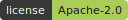
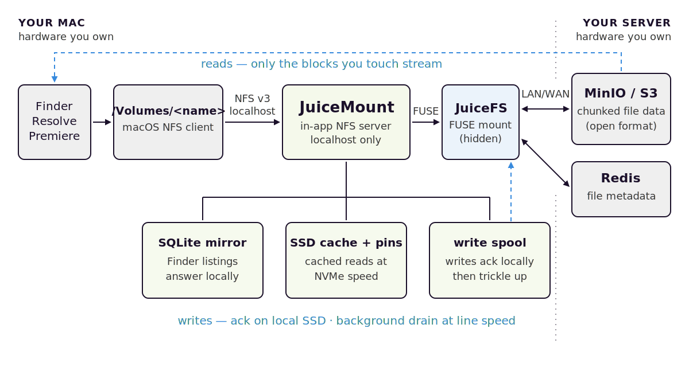

# JuiceMount

[](LICENSE)

[](https://github.com/juicedata/juicefs)


**Edit video straight off your NAS.** Your storage shows up in Finder as a real volume, and footage streams in as you scrub — only the blocks you touch. Premiere, Resolve, and Final Cut see a local drive. **$0 per seat, no storage contract**, on the NAS you already own.

> The open-source alternative to LucidLink, Suite, Shade, and Iconik — running entirely on hardware you control.

> **Status:** beta, macOS-only, self-hosted. It's been hardened hard for zero data loss on real ingest, but it's pre-1.0 and there's a server side you run yourself. If you want a managed service with a support line, this isn't that — see [What JuiceMount is not](#what-juicemount-is-not).

---

## For the editor

You already know the trade you've been making.

**Cloud editing storage** — LucidLink, Suite, Shade — gives you a drive that mounts and streams beautifully, and a per-seat, per-terabyte bill that grows with the one thing video makes most of. Your library lives inside someone else's filesystem.

**A NAS over plain SMB** is fast on the LAN and it's yours — but Finder grinds for a full minute opening a big project, there's no offline, and there's no good story the moment you leave the building.

**Sync tools** — Dropbox, Nextcloud, Seafile — own your bytes but move whole files. Open one shot to check focus on a 100 GB take and you wait for all 100 GB.

JuiceMount is the combination that didn't exist: **a real mounted volume that streams only the blocks you touch, caches to your local SSD, keeps working offline, and runs on storage you already own.** Point it at a TrueNAS, a Synology, a QNAP, or any box that runs Docker. Your editors mount `/Volumes/<name>` and cut. No per-seat bill, no storage contract, nobody else holding your footage.

---



## Your files become blocks — that's the magic

Most tools treat a video file as one object: to touch any of it, you move all of it. JuiceMount stores every file on your NAS as 4 MB blocks ([JuiceFS](https://github.com/juicedata/juicefs)'s open, documented format), and blocks travel independently.

Want three seconds from the middle of an 8 GB take? Three blocks — about **12 MB** — come over the wire. The rest never move. Scrub the timeline and the blocks you land on page into your local SSD cache and stay there, so the next pass is instant. That's why a 100 GB R3D opens and scrubs like it's sitting on your desk, even over a modest link.

And the format is open: if JuiceMount vanished tomorrow, the free stock `juicefs` client still mounts the volume and reads every byte. Your library is never locked inside this app.

---

## What editing on it feels like

- **It mounts for real — no relinking.** `/Volumes/<name>` is a genuine Finder volume, because to macOS it *is* one (a Finder-tuned NFS share served from localhost). It's the same absolute path on every Mac, so a teammate's `.prproj` / `.drp` / `.fcpx` opens with media already online — nobody spends the morning relinking.

- **Find anything in about 29 ms.** Press ⌘⇧F from any app. The search window answers from an index that lives on your Mac (SQLite, on your own SSD) — it never round-trips to the NAS. Filename search across ~131,000 entries comes back in ~29 ms. Spacebar for Quick Look, Enter to reveal in Finder, or drag a result straight into a Premiere / Resolve / Final Cut timeline.

- **Pin a project and keep cutting on a plane.** Pin a folder and a prefetcher pulls every byte to local SSD with per-folder progress. Flip on offline mode (cellular, plane, NAS asleep): pinned files keep reading at SSD speed, and un-pinned reads refuse in milliseconds instead of beachballing Finder on a 30-second timeout. Back online, it re-syncs itself. It can even **boot fully offline** — open the lid on a plane and your last-known library is right there to browse.

- **Drop a render and move on.** With the write spool on, a write is acknowledged the instant it's durable on your local SSD, then trickle-uploads to the NAS in the background — SHA-256-verified at every hop. A 2 GB Finder copy over a WAN feels like a local copy; the menu bar shows what's still uploading until it drains.

- **You drive it from the menu bar.** A state-tinted icon tells you at a glance whether your footage is safe (green), uploading, degraded (amber), or offline (blue). Create the mount, pin projects, flip offline, check the health of each backend — without babysitting a daemon.

---

## Requirements

Honest list — this is a self-hosted system, and there is a server side.

**On the Mac (client):**

- macOS 14 (Sonoma) or later (`Package.swift` targets `.macOS(.v14)`). Developed and tested on Apple Silicon; Intel Macs are untested (the build scripts produce host-architecture binaries, so an Intel build *should* work from source, but no one has verified it).
- [macFUSE](https://macfuse.github.io/) — required by the JuiceFS client. The first-run Setup Assistant preflight checks that it's installed and walks you through it if not.
- The `juicefs` binary (`brew install juicefs`; auto-detected from `/opt/homebrew/bin`, `/usr/local/bin`, `/usr/bin`, then `$PATH`).
- **An admin password prompt, once per session**, the first time JuiceMount mounts: macOS restricts `mount_nfs`/`umount` to root, so the app escalates through the standard macOS auth dialog (and macOS caches the authorization for the session). Optionally set up a [scoped passwordless-sudo rule](docs/dev-setup.md) to remove the prompt entirely.
- To build from source (currently the only way to get the app — no prebuilt/notarized DMG yet): Go 1.26+ and Xcode command-line tools (Swift 5.9+).

**On the server (any of these):**

- TrueNAS SCALE (the production-tested path — paste-the-YAML install, see [`server/INSTALL-TrueNAS.md`](server/INSTALL-TrueNAS.md)), or
- Any Linux box / Synology DSM 7+ / laptop with Docker + Docker Compose.
- Disk for two things: the MinIO object bucket (your actual media) and a small Redis dataset (metadata; AOF-persisted).
- A LAN you trust — the stack's Redis and MinIO ports are LAN-exposed by default; firewall them if untrusted clients share the network (see [`server/README.md` § Security notes](server/README.md)).

**Network:** anything from hotel Wi-Fi (with pinned files + the write spool) up to 10 GbE (where the throughput ceiling becomes your disks). For WAN use the author runs Tailscale; any VPN that gives the Mac a route to the Redis + MinIO ports works.

---

## Quick start

### 1. Server (≈10 minutes)

```sh
git clone https://github.com/lelanddutcher/juicemount
cd juicemount/server

# Edit docker-compose.yml: set the bind-mount paths for your disks
# and a strong MINIO_ROOT_PASSWORD (openssl rand -base64 24).

docker compose up -d
docker compose ps                    # wait for all services healthy
docker compose logs juicefs-init     # confirms first-time volume format
```

TrueNAS SCALE users: **Apps → Discover → ⋮ → Install via YAML**, paste the compose. Full walkthrough in [`server/INSTALL-TrueNAS.md`](server/INSTALL-TrueNAS.md).

Already have terabytes on the NAS? Open the **JuiceMount Manager** web UI at `http://<server>:30190` and use the Migrations tab — live progress, junk-file filtering (`.DS_Store`, `._*`, `Thumbs.db`), sequential job queue.

### 2. Mac

```sh
brew install juicefs
brew install --cask macfuse           # approve the system extension if macOS asks

git clone https://github.com/lelanddutcher/juicemount
cd juicemount
./scripts/build-app.sh                # Go c-archive + Swift app + codesign
./scripts/install.sh                  # → /Applications  (add --launchd for login start)
open /Applications/JuiceMount.app
```

A locally built app is not quarantined, so Gatekeeper won't object. If you instead obtained a pre-built `JuiceMount.app` from someone else (it's unsigned/ad-hoc-signed), macOS will block it: either remove the quarantine flag with `xattr -d com.apple.quarantine /Applications/JuiceMount.app`, or launch once and approve it under **System Settings → Privacy & Security → Open Anyway**.

On first launch the **Setup Assistant** opens automatically: it preflight-checks `juicefs`, macFUSE, and backend reachability, and walks you through pointing the app at your box (also reachable later via menu-bar icon → Setup Assistant…, or **Preferences → Connection**):

- **Redis URL:** `redis://<server>:30179/1`
- **S3 endpoint override:** `http://<server>:30151/<bucket>` (only needed if the volume was formatted with a docker-internal hostname)

(MinIO credentials live in the JuiceFS volume's format metadata in Redis — they don't need to be re-entered on the Mac.)

Hit **Start**. Enter your admin password at the mount prompt (once per session). `/Volumes/<name>` appears in Finder; point your NLE's media browser at it and edit.

---

## Under the mount

The editor-facing half is simple — a Finder volume. The half that makes it fast is below it.

<picture>
  <source media="(prefers-color-scheme: dark)" srcset="assets/readme/arch-diagram-dark.svg">
  
</picture>

Your NLE talks to a normal Finder volume — an **NFS share served from `127.0.0.1`, tuned for the way Finder hammers metadata.** Behind it, the hot path stays on your Mac:

- **Metadata** is answered from a **local SQLite mirror** — directory opens that take 3–10 s through raw FUSE complete in **15–120 ms**, because Finder never has to ask the NAS just to list a folder.
- **Reads** are served in priority order: memory buffer (small files like `.prproj`/LUTs) → a direct SSD-cache read that bypasses FUSE entirely → JuiceFS → your object store. Only a genuine cache miss crosses the wire, and only for the blocks involved.
- **Writes** (with the spool on) land on local SSD first and drain to the NAS in the background, SHA-256-verified at every hop, with boot-time crash recovery so an interrupted upload re-sends instead of vanishing.

Underneath all of that, **JuiceFS** breaks file data into chunks stored as S3 objects in MinIO (or any S3-compatible store), with file metadata in Redis. The hidden FUSE mount that JuiceFS needs lives at a dotfile path your NLE never browses. The object store can also be a cloud bucket (Backblaze B2, Cloudflare R2, Wasabi — anything S3-compatible JuiceFS supports), with Redis still on your box — though the self-hosted MinIO/TrueNAS path is the one this project's QA actually exercises.

**Your footage stays safe and yours.** Writes ack locally and re-send after a crash, the metadata map is backed up (not just the bytes), and the on-disk format is open and documented. The exit door is always unlocked: copy from the mounted volume, run `juicefs sync`, or mount the volume with the stock `juicefs` client — no JuiceMount involved.

Full architecture, the data-safety story, and the honest limits live in [`ARCHITECTURE_juicemount.md`](ARCHITECTURE_juicemount.md) and [`MENU_BAR_APP.md`](MENU_BAR_APP.md).

---

## Performance

All numbers below were **measured by the author on his own setup** (Apple-Silicon Mac ↔ TrueNAS SCALE over 10 GbE; methodology, workload scripts, and the regression harness in [`docs/PERFORMANCE_METHODOLOGY.md`](docs/PERFORMANCE_METHODOLOGY.md)). They are honest measurements, not marketing benchmarks — your hardware will differ.

| What | Measured |
|---|---|
| Sustained network throughput, 10 GbE LAN | ~7 Gbit/s up and down (author-measured) |
| Cached read through the full NFS path (`dd`, 200 MiB) | **226–571 MB/s**, READ p95 481 µs |
| Fully-cached 200 MiB sequential read | 431 MB/s with **4.6 MB** total network traffic |
| Pinned 350 MB file read, network off | 215+ MB/s sustained |
| Directory open, 100 K+-entry volume | 15–120 ms (3–10 s through raw FUSE) |
| Filename search across ~131 K entries | ~29 ms |
| Un-pinned read refusal in offline mode | 4–67 ms (vs. a 30 s NFS retry hang) |

The point isn't a single hero number — it's that you don't trade speed, ownership, or an offline story against each other. On the author's LAN, fully-cached reads are local-SSD fast, a cold scrub pulls only the blocks it touches, and the whole thing runs on hardware that's already paid for.

---

## What JuiceMount is not

Stating this up front saves everyone time:

- **Not a SaaS.** No hosted offering, no accounts, no billing. You run the server.
- **Not a review platform.** No browser viewer, comments, or approvals — Frame.io and friends own that lane and pair fine with this.
- **Not AI media search.** Filename search is instant today; content-aware search is on the roadmap, not a current feature.
- **Not multi-OS.** macOS only today. The server side runs anywhere Docker does.
- **Not a backup.** It's primary storage with a cache. Run real backups of the MinIO bucket and Redis — the Manager has backup-scheduling tooling, but the 3-2-1 discipline is yours.
- **Not zero-ops.** A failed disk on your NAS is your failed disk. That's the deal that makes it free.

---

## Roadmap

JuiceMount is past the hard part — the read/write/offline hot path has been hardened for zero data loss on real photo and video ingest. What's next is less about the edit experience and more about making it effortless to *stand up* and to *share* with a team.

**Recently shipped**

- **Offline, properly.** Start the app and browse your cached library with the network completely gone; bounded offline reads that fail fast instead of hanging Finder; a guard that warns when a pinned set is bigger than the disk can hold.
- **Snappier pinning** with a live "scanning…" state, and a menu-bar that recovers correctly after a network blip instead of getting stuck on "disconnected."
- **A cleaner Settings pane** and a Manager web UI trimmed of dead readouts.

**Next up**

1. **One-step server setup.** Today the biggest friction is standing up the NAS side. The next big sprint is a guided, near-one-click install — a first-class TrueNAS app and a single-command bring-up for any Docker host — so getting from "I have a NAS" to "my editors are mounting it" doesn't require hand-editing compose files.
2. **Deeper search.** Filename search is instant today; next is searching across more than names — richer metadata, and eventually content-aware search.
3. **Teams, done safely.** Multi-editor support with real collision handling: cooperative file locking so two people can't clobber the same project, presence ("who has this open"), and a simple admin tool to add people and hand out **editor** or **viewer** seats.
4. **A web interface.** A browser-based file manager for the volume — browse, upload, share links — most likely built on a proven open-source file browser rather than reinventing one.

**Exploring**

- Codec-aware Quick Look proxies (R3D / ARRI / BRAW / ProRes RAW).
- Content-hash backup verification with a traffic-light inventory.
- Bandwidth-aware automatic offline/streaming switching.

---

## FAQ

**What happens when the NAS is off, or I'm on a plane?**

Pin what you need first (popover → *Pin Folder for Offline…*, or Finder right-click → Services → *JuiceMount: Pin for Offline*): a prefetcher pulls every byte to local SSD and shows per-folder progress. Then flip on offline-files mode: pinned files keep reading at SSD speed, and un-pinned reads refuse in 4–67 ms instead of hanging Finder on a ~30 s NFS retry. The app can even start fully offline and serve your last-known library for browsing. Back online, *Sync Now* runs verify-and-repair on the pin set, re-fetching anything the cache evicted.

**What happens to my writes if the network drops or the server dies mid-copy?**

With the write spool enabled (Preferences → Cache & Storage), a write is acknowledged the moment it's durable on local SSD; a background drainer uploads it once the server is reachable, SHA-256-verified at every hop. The popover shows pending / in-flight / stalled / failed uploads with per-entry age and last error, offers *Retry failed* and *Recover stalled*, and the app guards quit and spool-disable while uploads are pending so spooled data isn't stranded. With the spool off (the default), writes go through to the server synchronously — if the backend is unreachable, the write fails the way it would on any network drive. Note that offline-files mode gates *reads*; it doesn't make un-spooled writes safe. <!-- sources: docs/dev-setup.md (write path), MENU_BAR_APP.md (spool UI); the offline open gate in nfs/handler.go applies to reads only -->

**Can two Macs mount the same volume?**

Yes — every machine mounts the same `/Volumes/<name>`, metadata syncs through the shared Redis instance, and project files reference media at identical paths, so a teammate's `.prproj`/`.drp`/`.fcpx` opens without relinking. That's the designed multi-machine workflow. One honest caveat: heavy *simultaneous* multi-editor use hasn't been soak-tested yet — most QA to date is single-editor, and cooperative locking + seats are on the roadmap above.

**Is my data locked in?**

No. Your bytes are on your hardware — copy them from the mounted volume, or `juicefs sync` them out; the bucket stays under your control. In the bucket, file data lives in JuiceFS's open, documented chunk format, and the volume is a standard JuiceFS volume (the server stack formats it with stock `juicefs format`), so the stock `juicefs` client can mount it with no JuiceMount involved. <!-- standard-volume claim: server/INSTALL-TrueNAS.md runs stock juicefs format -->

**How much disk does the cache use?**

You set the cache size in Preferences → Cache & Storage; JuiceMount grows the cache only as far as needed to keep your pinned content fully cached, and clamps it so the boot disk always keeps at least 10 GiB free. It also reclaims APFS purgeable space — mostly Time Machine local snapshots — at mount time and on demand via the popover's *Reclaim* button. When you leave, `scripts/uninstall.sh` shows the size of everything it would delete before touching anything; the JuiceFS chunk cache is usually the big one (it can be hundreds of GB).

<details>
<summary><strong>Why an NFS loopback server instead of using FUSE directly, or a File Provider extension?</strong></summary>

Finder performance, mostly. Metadata is the thing Finder hammers hardest, and JuiceMount answers it from a local SQLite mirror behind a Finder-tuned NFS server — directory opens that take 3–10 s through the raw FUSE mount complete in 15–120 ms. The FUSE mount still exists underneath (JuiceFS needs it), but it's hidden and apps never touch it. As for File Provider: never. An orphaned File Provider registration once pinned two system daemons above 100% CPU and collapsed this very NFS path to 13 MB/s — and the registration outlived the app, the source project, and a reboot. [`docs/no-fileprovider.md`](docs/no-fileprovider.md) is the postmortem; the build script fails if a plugin ever sneaks into the bundle.

</details>

<details>
<summary><strong>What exactly is the relationship to JuiceFS?</strong></summary>

JuiceMount is built on JuiceFS and says so loudly (see the credit section below and [`NOTICE`](NOTICE)). JuiceFS solved the distributed-filesystem problems — chunked object layout, the Redis metadata engine, cache management — and JuiceMount adds the macOS experience layer: the Finder-tuned NFS re-export, the SQLite metadata cache, pinning and offline gates, the write spool, the menu-bar app, and the server packaging. The app drives the separately installed `juicefs` binary (`brew install juicefs`); it isn't bundled. If your problem isn't video-on-macOS, use JuiceFS directly — it's excellent.

</details>

<details>
<summary><strong>Does it phone home?</strong></summary>

No. The app's network connections are the Redis and S3 endpoints you configure, plus a loopback control plane on `127.0.0.1`. JuiceFS's own anonymous usage reporting is explicitly disabled — the app passes `--no-usage-report` when mounting. There's no crash reporting, no update check, no analytics; "no telemetry without opt-in" is a stated non-negotiable (see [Contributing](#contributing)). Diagnostics exist only as a local zip you create yourself with Export Diagnostics and choose to share. <!-- verified: health/fuse.go passes the no-usage-report flag to juicefs mount; the app's only URLSession targets are loopback control-plane routes -->

</details>

<details>
<summary><strong>Does it run on Intel Macs?</strong></summary>

Untested, honestly. Development and testing are on Apple Silicon; the build scripts produce host-architecture binaries, so building from source on an Intel Mac *should* work, but no one has verified it. macOS 14 (Sonoma) or later applies either way. If you try it, a report — success or failure — is a genuinely useful contribution.

</details>

---

## Troubleshooting

The popover's health rows (Redis / MinIO / FUSE / NFS mount) are the first thing to check — most fixes start there. Deeper app-side detail lives in [`MENU_BAR_APP.md`](MENU_BAR_APP.md).

**The volume doesn't appear in Finder.** Open the popover: if the NFS row says "Volume not mounted", click **Mount Now** — a privileged re-mount that may show the admin prompt once. (Scriptable as `/mount-now` on the control plane.) Also check that something else doesn't already own the path: `mount | grep <volume-name>`.

**Finder says "not responding", or the icon turns amber.** Amber means degraded: running, but a backend (Redis / MinIO / FUSE / NFS) is unhealthy or recovering — the popover names which one and why. Give it a moment: the health monitor force-remounts a wedged FUSE daemon once the backend is reachable again, and an independent watchdog keeps the menu-bar state converging on reality instead of sticking. If the kernel mount itself is wedged — server died, every Finder access hangs — **Force Eject** in the popover is the last resort: a privileged kernel-level unmount behind a confirmation dialog. <!-- self-heal story: health/monitor.go watchdog + ServerController recovery watchdog; Force Eject: MenuPopoverView.swift -->

**Uploads look stuck.** With the spool enabled, the popover's *Pending uploads* section shows pending / in-flight / stalled / failed counts with per-entry age and last error; **Retry failed** and **Recover stalled** act on them directly. A full spool surfaces to Finder as "disk full" rather than a mystery error.

**Where logs live.** Structured JSON at `~/Library/Logs/JuiceMount/juicemount.log` (16 MB × 5 rotation); `tail -f … | jq .` for live debugging. For a bug report, use **Export Diagnostics…** (in the popover and in Preferences → Maintenance): it bundles logs, the mount table, and backend health into a local zip — nothing is sent anywhere.

**Uninstalling.** `./scripts/uninstall.sh` stops the app, unmounts, shows exactly what it will remove with sizes, and asks once. One warning worth repeating from the script itself: if the write spool still holds files, those are uploads that never reached the server — deleting them loses data, so that step requires its own explicit confirmation. It deliberately leaves the app bundle, the `juicefs` binary, macFUSE, and everything on your server alone; `--dry-run` previews the whole plan.

---

## Built on JuiceFS — credit where due

JuiceMount exists because [JuiceFS](https://github.com/juicedata/juicefs) (Apache-2.0, by [Juicedata](https://juicefs.com)) solved the hard distributed-filesystem problems — chunked object layout, Redis metadata engine, cache management — and proved them in production for years. JuiceMount is a macOS-native experience layer on top: the Finder-tuned NFS re-export, metadata caching, pinning, offline gates, the write spool, the menu-bar app, and the server packaging. The NFS server is a fork of [`willscott/go-nfs`](https://github.com/willscott/go-nfs) (Apache-2.0), vendored at `internal/nfs` and attributed in [`NOTICE`](NOTICE).

If JuiceFS itself fits your (non-video, non-macOS) problem, use it directly — it's excellent.

## License

[Apache License 2.0](LICENSE). Third-party attributions (JuiceFS, go-nfs, go-nfs-client) are in [`NOTICE`](NOTICE); JuiceFS and go-nfs are likewise Apache-2.0, go-nfs-client is BSD-2-Clause.

## Contributing

- **Bugs:** open an issue with the diagnostic zip (menu-bar → Export Diagnostics) — it bundles logs, mount table, and backend health.
- **Code:** one theme per PR — stability fixes never share a commit with features. Run `go vet ./...` and `go test -race` on touched packages; request-path changes get an adversarial review pass.
- **Testing on real hardware** is the most valuable contribution: different NAS vendors, network shapes, and NLE versions. Real Finder/Resolve/Premiere testing beats synthetic checks — that rule is earned.
- **Developer setup** (passwordless mount for fast test cycles, headless CLI, config reference): [`docs/dev-setup.md`](docs/dev-setup.md).

*Non-negotiables, so you don't waste a PR:* no telemetry without opt-in, no proprietary dependencies for self-hosters, no FileProviderExtension (ever — [`docs/no-fileprovider.md`](docs/no-fileprovider.md) is the postmortem), reliability beats novelty.
